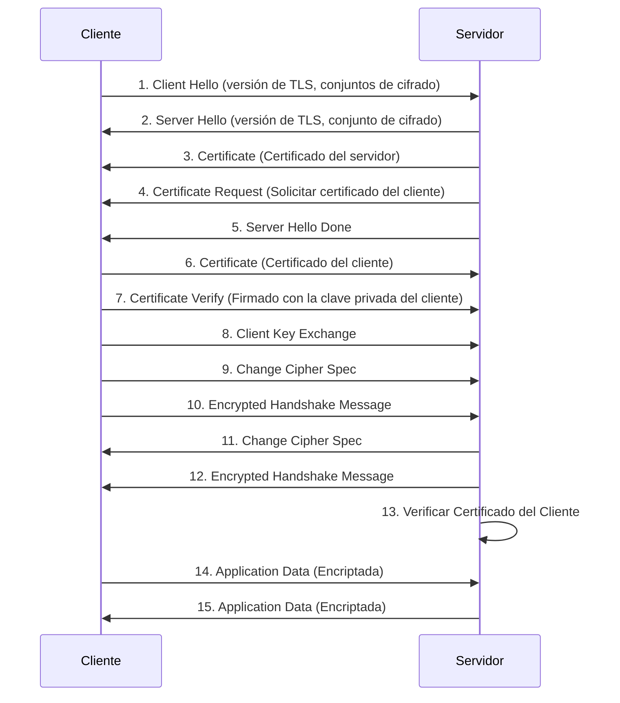

# Ejemplo de Mutual TLS (mTLS)

Este proyecto demuestra la autenticación TLS Mutua (mTLS), un mecanismo de seguridad donde tanto el cliente como el servidor verifican las identidades del otro utilizando certificados digitales antes de establecer una conexión segura.

## ¿Qué es mTLS?

En el TLS tradicional, solo el cliente verifica la identidad del servidor. mTLS agrega una capa adicional de seguridad al requerir que el servidor también verifique la identidad del cliente. Esto asegura que ambas partes sean quienes dicen ser, protegiendo contra el acceso no autorizado y los ataques de intermediario (man-in-the-middle).

## Diagrama de Handshake de mTLS



## Descripción General del Proyecto

Este proyecto consta de un servidor Flask y un proxy inverso Nginx configurado para aplicar mTLS.

*   **`app.py`:** Una aplicación Flask simple que extrae el Nombre Común (CN) del certificado del cliente del encabezado `X-SSL-Client-CN` y lo devuelve. También tiene un endpoint `/secure-data` que requiere un certificado de cliente.
*   **`Dockerfile.flask`:** Define la imagen Docker para la aplicación Flask.
*   **`docker-compose.yml`:** Define los servicios (Flask y Nginx) y sus configuraciones para ejecutar la aplicación usando Docker Compose.
*   **`nginx.conf`:** Configura Nginx para escuchar en el puerto 8443, habilitar SSL, requerir certificados de cliente y reenviar solicitudes a la aplicación Flask. También establece el encabezado `X-SSL-Client-CN` con el CN del cliente.
*   **`utils/gen_client_cert.sh`:** Un script para generar certificados de cliente.
*   **`utils/gen_server_cert.sh`:** Un script para generar una Autoridad de Certificación (CA) y certificados de servidor.

## Generando Certificados

1.  **Generar CA y Certificados de Servidor:**

    ```bash
    cd utils
    ./gen_server_cert.sh
    cd ..
    ```

2.  **Generar Certificados de Cliente:**

    ```bash
    cd utils
    ./gen_client_cert.sh <nombre de usuario>
    cd ..
    ```

    Reemplace `<nombre de usuario>` con el nombre de usuario deseado para el certificado de cliente. Por ejemplo:

    ```bash
    cd utils
    ./gen_client_cert.sh user
    cd ..
    ```

    Esto creará los siguientes archivos en el directorio `certs/<nombre de usuario>/`:

    *   `<nombre de usuario>.key`: Clave privada del cliente.
    *   `<nombre de usuario>.crt`: Certificado del cliente.
    *   `certs/ca.pem`: Certificado público de la CA (necesario para que el cliente confíe en el servidor).

## Ejecutando el Servidor

1. **Generar certificados para servidor y cliente:**

    ```bash
    cd utils
    ./gen_server_cert.sh
    ./gen_client_cert.sh user
    cd ..
    ```
2. **Almacenar el certificado del cliente en un lugar seguro**
    
    Copiar el `ca.pem` de la carpeta `certs` y la carpeta de las claves privadas del usuario a un lugar seguro.

2.  **Construya y ejecute los servicios usando Docker Compose:**

    ```bash
    docker-compose up --build
    ```

3.  **Acceda a la aplicación:**

    Use `curl` para probar la conexión, proporcionando el certificado de cliente, la clave y el certificado de la CA:

    ```bash
    curl -v https://localhost:8443/test --key certs/<nombre de usuario>/<nombre de usuario>.key --cert certs/<nombre de usuario>/<nombre de usuario>.crt  --cacert certs/ca.pem
    ```

    Reemplace `<nombre de usuario>` con el nombre de usuario que utilizó al generar el certificado de cliente.

    Debería ver una respuesta JSON que contiene el mensaje "Test OK" y el CN del cliente.

    #####    Ejemplo con el usuario "user"

    ```bash
    curl -v https://localhost:8443/test --key certs/user/user.key --cert certs/user/user.crt  --cacert certs/ca.pem
    ```

## Probando el Endpoint Seguro

Para acceder al endpoint `/secure-data`, debe proporcionar un certificado de cliente válido. Si no lo hace, recibirá un error 403 Forbidden.

```bash
curl -v https://localhost:8443/secure-data --key certs/<nombre de usuario>/<nombre de usuario>.key --cert certs/<nombre de usuario>/<nombre de usuario>.crt  --cacert certs/ca.pem
```
##### Ejemplo con el usuario "user"

```bash
curl -v https://localhost:8443/secure-data --key certs/user/user.key --cert certs/user/user.crt  --cacert certs/ca.pem
```

## Notas Importantes

*   El archivo `nginx.conf` está configurado para requerir certificados de cliente.
*   La aplicación Flask extrae el CN del certificado de cliente del encabezado `X-SSL-Client-CN`, que está configurado por Nginx.
*   Los scripts `utils/gen_client_cert.sh` y `utils/gen_server_cert.sh` se proporcionan por conveniencia. Puede utilizar otras herramientas para generar certificados si lo prefiere.
*   ¡Recuerde proteger sus claves privadas!

## .env

El archivo `.env` contiene variables de entorno utilizadas para configurar la aplicación, como el puerto en el que escucha Nginx.

```
NGINX_PORT=8443
```

## docker-compose.yml

El archivo `docker-compose.yml` define los servicios, redes y volúmenes utilizados para ejecutar la aplicación utilizando Docker Compose. Especifica la aplicación Flask y el proxy inverso Nginx, junto con sus configuraciones y dependencias.

```yaml
version: '3'

services:
  flask:
    build:
      context: .
      dockerfile: Dockerfile.flask
    expose:
      - "5000"

  nginx:
    image: nginx:1.22
    volumes:
      - ./nginx.conf:/etc/nginx/conf.d/default.conf:ro
      - ./certs:/etc/ssl/certs:ro
      - ./private:/etc/ssl/private:ro
    ports:
      - "${NGINX_PORT}:8443"
    depends_on:
      - flask
```
